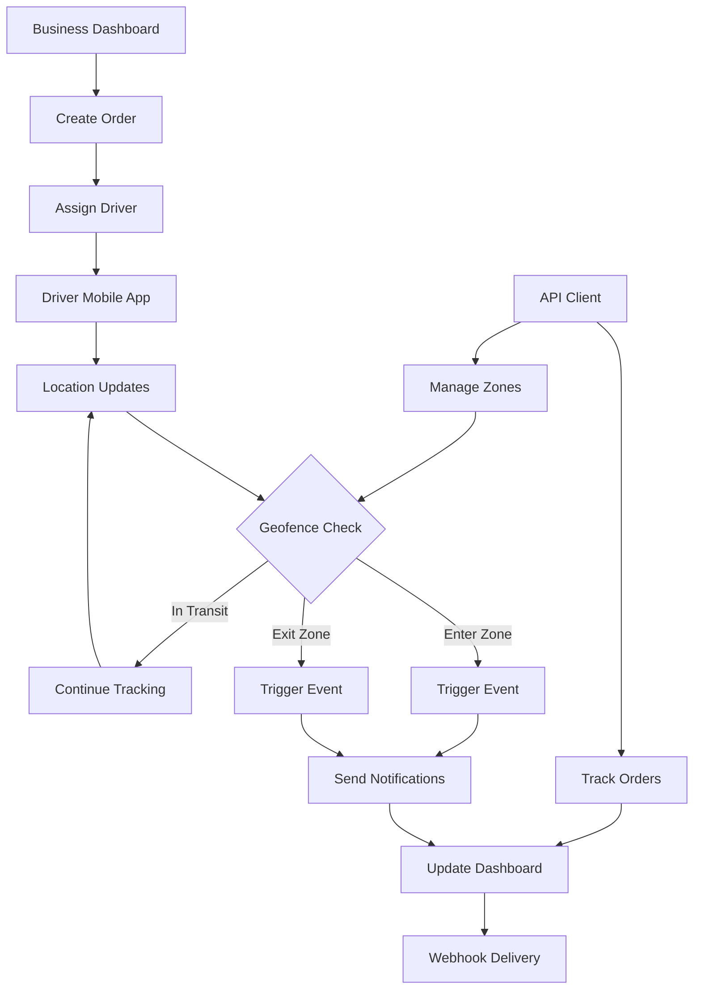

# ZoneFlow - Unified Logistics Platform
## Product Requirements Document

## 1. Product Overview
ZoneFlow is a comprehensive logistics API platform that combines real-time order tracking with intelligent geofencing capabilities, enabling businesses to automate delivery workflows and trigger custom events based on location data.

The platform solves the fragmented logistics tracking problem by providing a unified API that handles order management, real-time location tracking, and automated zone-based triggers. Target customers include small to medium delivery businesses, e-commerce platforms, and logistics coordinators who need reliable tracking and automation without complex infrastructure.

ZoneFlow aims to become the go-to SaaS solution for logistics automation, with potential to capture significant market share in the growing last-mile delivery sector.

## 2. Core Features

### 2.1 User Roles

| Role | Registration Method | Core Permissions |
|------|---------------------|------------------|
| Business Owner | Email registration + business verification | Full platform access, API key management, billing |
| Dispatcher | Invitation by Business Owner | Order management, driver assignment, zone configuration |
| Delivery Agent | Mobile app registration + company code | Location updates, order status changes, delivery confirmation |
| API Client | API key integration | Programmatic access to tracking and geofencing services |

### 2.2 Feature Module

Our ZoneFlow platform consists of the following main pages:

1. **Dashboard**: Real-time order overview, active deliveries map, zone status monitoring, performance analytics
2. **Order Management**: Order creation, tracking timeline, delivery assignment, status updates
3. **Geofence Management**: Zone creation and editing, trigger configuration, event history
4. **Driver Management**: Agent profiles, location tracking, performance metrics, assignment history
5. **API Console**: API key management, webhook configuration, usage analytics, documentation
6. **Settings**: Account management, notification preferences, integration settings

### 2.3 Page Details

| Page Name | Module Name | Feature description |
|-----------|-------------|---------------------|
| Dashboard | Real-time Map | Display active deliveries with live location updates, zone boundaries, and delivery routes |
| Dashboard | Analytics Overview | Show delivery performance metrics, zone trigger statistics, and operational insights |
| Dashboard | Alert Center | Display real-time notifications for zone entries/exits, delivery delays, and system alerts |
| Order Management | Order Creation | Create new orders with pickup/delivery addresses, assign delivery agents, set priority levels |
| Order Management | Tracking Timeline | Display order status progression with timestamps, location history, and estimated delivery times |
| Order Management | Bulk Operations | Import/export orders, batch status updates, and mass assignment capabilities |
| Geofence Management | Zone Designer | Create circular and polygon geofences using interactive map interface with radius/boundary tools |
| Geofence Management | Trigger Configuration | Set up automated actions for zone entry/exit events including webhooks and notifications |
| Geofence Management | Event History | View historical zone trigger events with timestamps, coordinates, and associated actions |
| Driver Management | Agent Profiles | Manage driver information, contact details, vehicle information, and availability status |
| Driver Management | Live Tracking | Monitor real-time driver locations, route progress, and delivery status updates |
| Driver Management | Performance Analytics | Track delivery completion rates, average delivery times, and customer ratings |
| API Console | Key Management | Generate, revoke, and monitor API keys with usage limits and access permissions |
| API Console | Webhook Configuration | Set up and test webhook endpoints for order updates and geofence events |
| API Console | Usage Analytics | Monitor API call volumes, response times, and error rates with detailed logs |
| Settings | Account Management | Update business profile, billing information, and subscription plans |
| Settings | Notification Settings | Configure email, SMS, and push notification preferences for different event types |
| Settings | Integration Settings | Manage third-party integrations including mapping services and communication platforms |

## 3. Core Process

**Business Owner Flow:**
1. Register account and verify business details
2. Set up geofence zones around delivery areas, warehouses, and customer locations
3. Configure automated triggers for zone events (notifications, status updates, webhooks)
4. Create orders with pickup and delivery addresses
5. Assign delivery agents and monitor real-time progress
6. Receive automated notifications when drivers enter/exit zones
7. Access analytics and performance reports

**Delivery Agent Flow:**
1. Download mobile app and register with company code
2. Receive order assignments with optimized routes
3. Update location automatically while on delivery
4. Scan QR codes at pickup and delivery points
5. Trigger automatic status updates when entering/exiting zones
6. Confirm deliveries and capture customer signatures

**API Client Flow:**
1. Obtain API keys from business dashboard
2. Integrate tracking and geofencing endpoints into existing systems
3. Set up webhooks to receive real-time event notifications
4. Monitor order progress and zone events programmatically

## 4. User Interface Design

### 4.1 Design Style
- **Primary Colors**: Deep blue (#1E40AF) for trust and reliability, bright green (#10B981) for success states
- **Secondary Colors**: Light gray (#F3F4F6) for backgrounds, orange (#F59E0B) for warnings and alerts
- **Button Style**: Rounded corners (8px radius) with subtle shadows, gradient backgrounds for primary actions
- **Font**: Inter font family, 14px base size for body text, 16px for buttons, 24px+ for headings
- **Layout Style**: Card-based design with clean spacing, top navigation with sidebar for main sections
- **Icons**: Heroicons for consistency, location pins and route icons for mapping features

### 4.2 Page Design Overview

| Page Name | Module Name | UI Elements |
|-----------|-------------|-------------|
| Dashboard | Real-time Map | Full-width interactive map with custom markers, floating control panels, dark theme option |
| Dashboard | Analytics Overview | Grid layout with metric cards, chart.js visualizations, color-coded performance indicators |
| Order Management | Order Creation | Multi-step form with address autocomplete, driver selection dropdown, priority toggle switches |
| Order Management | Tracking Timeline | Vertical timeline with status icons, expandable details, real-time progress indicators |
| Geofence Management | Zone Designer | Split-screen layout with map editor and configuration panel, drag-and-drop zone creation |
| Driver Management | Live Tracking | List view with driver cards showing photos, status badges, and mini-map previews |
| API Console | Documentation | Clean documentation layout with code examples, interactive API explorer, copy-to-clipboard buttons |

### 4.3 Responsiveness
The platform is desktop-first with mobile-adaptive design for the business dashboard. The delivery agent mobile app is optimized for touch interaction with large buttons, GPS-friendly interfaces, and offline capability for poor connectivity areas.