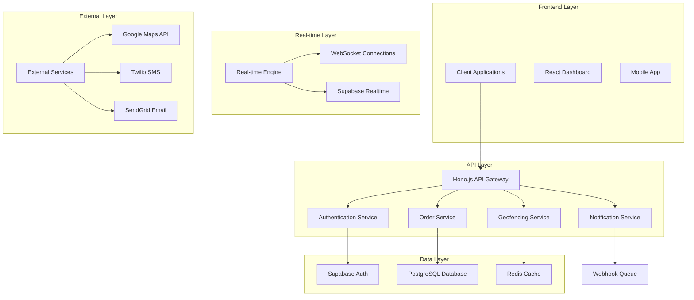
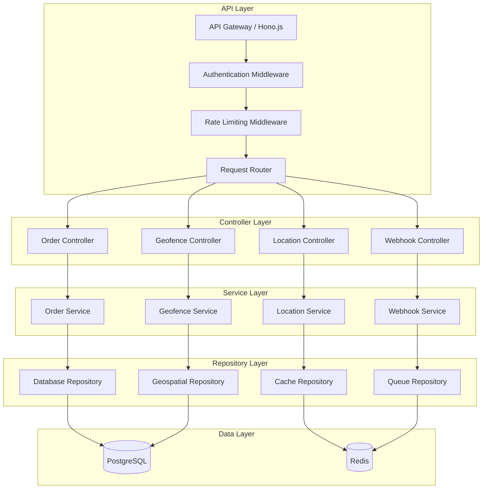
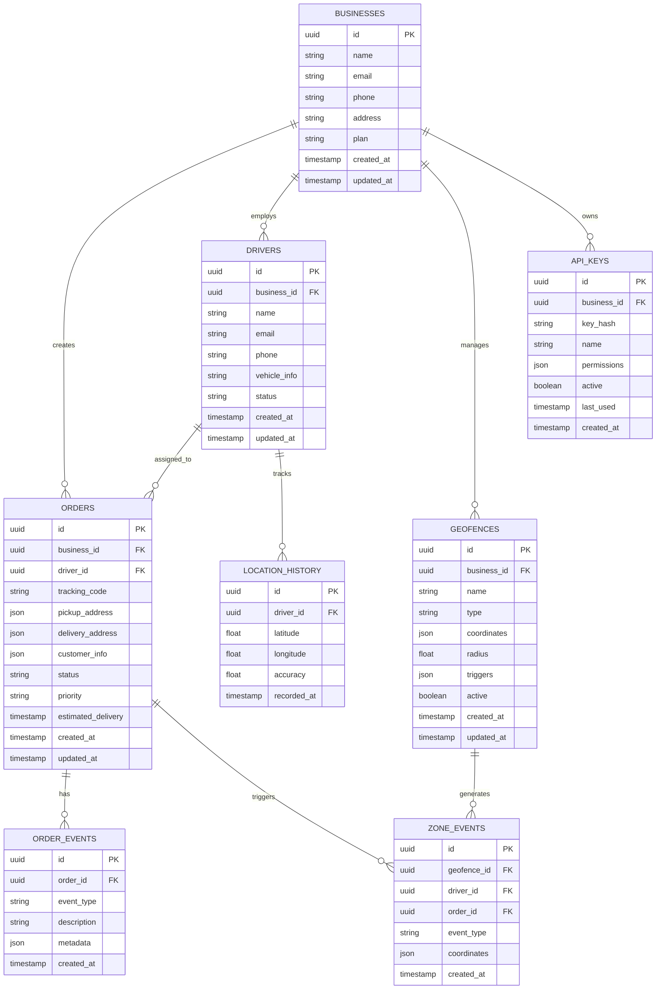

# ZoneFlow - Technical Architecture Document

## 1. Architecture Design



## 2. Technology Description

- **Frontend**: React@18 + TypeScript + Tailwind CSS + Vite
- **Backend**: Hono.js + TypeScript + Cloudflare Workers
- **Database**: Supabase (PostgreSQL) + Redis (Upstash)
- **Real-time**: Supabase Realtime + WebSockets
- **Maps**: Google Maps API + Turf.js for geospatial calculations
- **Authentication**: Supabase Auth
- **Notifications**: Twilio (SMS) + SendGrid (Email)
- **Deployment**: Cloudflare Workers + Vercel (Frontend)

## 3. Route Definitions

| Route | Purpose |
|-------|---------|
| / | Landing page with platform overview and pricing |
| /dashboard | Main business dashboard with real-time order and zone monitoring |
| /orders | Order management interface for creating and tracking deliveries |
| /orders/:id | Individual order details with timeline and location history |
| /zones | Geofence management for creating and configuring zones |
| /zones/:id | Individual zone configuration and event history |
| /drivers | Driver management and live tracking interface |
| /drivers/:id | Individual driver profile and performance metrics |
| /api-console | API key management and webhook configuration |
| /settings | Account settings and platform configuration |
| /login | Authentication page for business users |
| /register | Business registration with verification process |

## 4. API Definitions

### 4.1 Core API

**Order Management**
```
POST /api/orders
```

Request:
| Param Name | Param Type | isRequired | Description |
|------------|------------|------------|-------------|
| pickup_address | string | true | Full pickup address with coordinates |
| delivery_address | string | true | Full delivery address with coordinates |
| customer_info | object | true | Customer name, phone, email |
| driver_id | string | false | Assigned driver ID (can be assigned later) |
| priority | enum | false | low, medium, high, urgent |
| estimated_delivery | datetime | false | Expected delivery time |

Response:
| Param Name | Param Type | Description |
|------------|------------|-------------|
| order_id | string | Unique order identifier |
| tracking_code | string | Customer-facing tracking code |
| status | string | Current order status |
| created_at | datetime | Order creation timestamp |

**Geofence Management**
```
POST /api/geofences
```

Request:
| Param Name | Param Type | isRequired | Description |
|------------|------------|------------|-------------|
| name | string | true | Zone name for identification |
| type | enum | true | circle, polygon |
| coordinates | array | true | Center point (circle) or boundary points (polygon) |
| radius | number | false | Radius in meters (required for circle type) |
| triggers | object | true | Entry/exit event configurations |

Response:
| Param Name | Param Type | Description |
|------------|------------|-------------|
| zone_id | string | Unique zone identifier |
| status | string | Active, inactive |
| created_at | datetime | Zone creation timestamp |

**Location Tracking**
```
POST /api/locations
```

Request:
| Param Name | Param Type | isRequired | Description |
|------------|------------|------------|-------------|
| driver_id | string | true | Driver identifier |
| latitude | number | true | GPS latitude coordinate |
| longitude | number | true | GPS longitude coordinate |
| accuracy | number | false | GPS accuracy in meters |
| timestamp | datetime | true | Location timestamp |

Response:
| Param Name | Param Type | Description |
|------------|------------|-------------|
| location_id | string | Unique location record ID |
| zone_events | array | Triggered zone entry/exit events |
| order_updates | array | Automatic order status updates |

**Webhook Events**
```
POST /api/webhooks
```

Request:
| Param Name | Param Type | isRequired | Description |
|------------|------------|------------|-------------|
| url | string | true | Webhook endpoint URL |
| events | array | true | Event types to subscribe to |
| secret | string | false | Webhook signature secret |
| active | boolean | true | Enable/disable webhook |

Example Webhook Payload:
```json
{
  "event_type": "zone_entry",
  "timestamp": "2024-01-15T10:30:00Z",
  "data": {
    "driver_id": "driver_123",
    "zone_id": "zone_456",
    "order_id": "order_789",
    "coordinates": {
      "latitude": 40.7128,
      "longitude": -74.0060
    }
  }
}
```

## 5. Server Architecture Diagram



## 6. Data Model

### 6.1 Data Model Definition



### 6.2 Data Definition Language

**Businesses Table**
```sql
-- Create businesses table
CREATE TABLE businesses (
    id UUID PRIMARY KEY DEFAULT gen_random_uuid(),
    name VARCHAR(255) NOT NULL,
    email VARCHAR(255) UNIQUE NOT NULL,
    phone VARCHAR(50),
    address TEXT,
    plan VARCHAR(20) DEFAULT 'free' CHECK (plan IN ('free', 'starter', 'professional', 'enterprise')),
    created_at TIMESTAMP WITH TIME ZONE DEFAULT NOW(),
    updated_at TIMESTAMP WITH TIME ZONE DEFAULT NOW()
);

-- Create index
CREATE INDEX idx_businesses_email ON businesses(email);
CREATE INDEX idx_businesses_plan ON businesses(plan);
```

**Drivers Table**
```sql
-- Create drivers table
CREATE TABLE drivers (
    id UUID PRIMARY KEY DEFAULT gen_random_uuid(),
    business_id UUID NOT NULL REFERENCES businesses(id) ON DELETE CASCADE,
    name VARCHAR(255) NOT NULL,
    email VARCHAR(255),
    phone VARCHAR(50) NOT NULL,
    vehicle_info JSONB,
    status VARCHAR(20) DEFAULT 'available' CHECK (status IN ('available', 'busy', 'offline')),
    created_at TIMESTAMP WITH TIME ZONE DEFAULT NOW(),
    updated_at TIMESTAMP WITH TIME ZONE DEFAULT NOW()
);

-- Create indexes
CREATE INDEX idx_drivers_business_id ON drivers(business_id);
CREATE INDEX idx_drivers_status ON drivers(status);
```

**Orders Table**
```sql
-- Create orders table
CREATE TABLE orders (
    id UUID PRIMARY KEY DEFAULT gen_random_uuid(),
    business_id UUID NOT NULL REFERENCES businesses(id) ON DELETE CASCADE,
    driver_id UUID REFERENCES drivers(id) ON DELETE SET NULL,
    tracking_code VARCHAR(20) UNIQUE NOT NULL,
    pickup_address JSONB NOT NULL,
    delivery_address JSONB NOT NULL,
    customer_info JSONB NOT NULL,
    status VARCHAR(20) DEFAULT 'created' CHECK (status IN ('created', 'assigned', 'picked_up', 'in_transit', 'delivered', 'cancelled')),
    priority VARCHAR(10) DEFAULT 'medium' CHECK (priority IN ('low', 'medium', 'high', 'urgent')),
    estimated_delivery TIMESTAMP WITH TIME ZONE,
    created_at TIMESTAMP WITH TIME ZONE DEFAULT NOW(),
    updated_at TIMESTAMP WITH TIME ZONE DEFAULT NOW()
);

-- Create indexes
CREATE INDEX idx_orders_business_id ON orders(business_id);
CREATE INDEX idx_orders_driver_id ON orders(driver_id);
CREATE INDEX idx_orders_tracking_code ON orders(tracking_code);
CREATE INDEX idx_orders_status ON orders(status);
CREATE INDEX idx_orders_created_at ON orders(created_at DESC);
```

**Geofences Table**
```sql
-- Create geofences table
CREATE TABLE geofences (
    id UUID PRIMARY KEY DEFAULT gen_random_uuid(),
    business_id UUID NOT NULL REFERENCES businesses(id) ON DELETE CASCADE,
    name VARCHAR(255) NOT NULL,
    type VARCHAR(10) NOT NULL CHECK (type IN ('circle', 'polygon')),
    coordinates JSONB NOT NULL,
    radius FLOAT,
    triggers JSONB NOT NULL,
    active BOOLEAN DEFAULT true,
    created_at TIMESTAMP WITH TIME ZONE DEFAULT NOW(),
    updated_at TIMESTAMP WITH TIME ZONE DEFAULT NOW()
);

-- Create indexes
CREATE INDEX idx_geofences_business_id ON geofences(business_id);
CREATE INDEX idx_geofences_active ON geofences(active);
```

**Location History Table**
```sql
-- Create location_history table
CREATE TABLE location_history (
    id UUID PRIMARY KEY DEFAULT gen_random_uuid(),
    driver_id UUID NOT NULL REFERENCES drivers(id) ON DELETE CASCADE,
    latitude DECIMAL(10, 8) NOT NULL,
    longitude DECIMAL(11, 8) NOT NULL,
    accuracy FLOAT,
    recorded_at TIMESTAMP WITH TIME ZONE DEFAULT NOW()
);

-- Create indexes
CREATE INDEX idx_location_history_driver_id ON location_history(driver_id);
CREATE INDEX idx_location_history_recorded_at ON location_history(recorded_at DESC);
CREATE INDEX idx_location_history_coordinates ON location_history(latitude, longitude);
```

**Zone Events Table**
```sql
-- Create zone_events table
CREATE TABLE zone_events (
    id UUID PRIMARY KEY DEFAULT gen_random_uuid(),
    geofence_id UUID NOT NULL REFERENCES geofences(id) ON DELETE CASCADE,
    driver_id UUID NOT NULL REFERENCES drivers(id) ON DELETE CASCADE,
    order_id UUID REFERENCES orders(id) ON DELETE SET NULL,
    event_type VARCHAR(20) NOT NULL CHECK (event_type IN ('entry', 'exit', 'dwell')),
    coordinates JSONB NOT NULL,
    created_at TIMESTAMP WITH TIME ZONE DEFAULT NOW()
);

-- Create indexes
CREATE INDEX idx_zone_events_geofence_id ON zone_events(geofence_id);
CREATE INDEX idx_zone_events_driver_id ON zone_events(driver_id);
CREATE INDEX idx_zone_events_order_id ON zone_events(order_id);
CREATE INDEX idx_zone_events_created_at ON zone_events(created_at DESC);
```

**Initial Data**
```sql
-- Insert sample business
INSERT INTO businesses (name, email, phone, address, plan) VALUES
('Demo Logistics', 'demo@zoneflow.com', '+1-555-0123', '123 Business St, San Francisco, CA', 'professional');

-- Insert sample drivers
INSERT INTO drivers (business_id, name, email, phone, vehicle_info, status) VALUES
((SELECT id FROM businesses WHERE email = 'demo@zoneflow.com'), 'John Driver', 'john@demo.com', '+1-555-0124', '{"type": "van", "plate": "ABC123"}', 'available'),
((SELECT id FROM businesses WHERE email = 'demo@zoneflow.com'), 'Jane Courier', 'jane@demo.com', '+1-555-0125', '{"type": "bike", "plate": "XYZ789"}', 'available');

-- Grant permissions
GRANT SELECT ON businesses TO anon;
GRANT ALL PRIVILEGES ON businesses TO authenticated;
GRANT SELECT ON drivers TO anon;
GRANT ALL PRIVILEGES ON drivers TO authenticated;
GRANT SELECT ON orders TO anon;
GRANT ALL PRIVILEGES ON orders TO authenticated;
GRANT SELECT ON geofences TO anon;
GRANT ALL PRIVILEGES ON geofences TO authenticated;
GRANT SELECT ON location_history TO anon;
GRANT ALL PRIVILEGES ON location_history TO authenticated;
GRANT SELECT ON zone_events TO anon;
GRANT ALL PRIVILEGES ON zone_events TO authenticated;
```